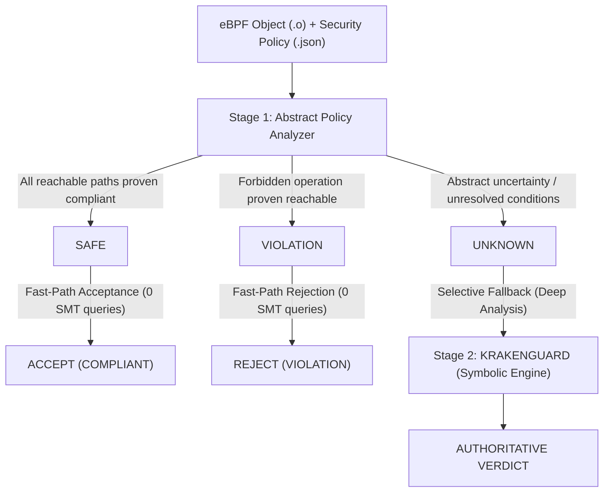

# Phase 5 — Abstract Policy Analyzer Specification

**Status**: IMPLEMENTED & VALIDATED  
**Artifact**: `research/analyzer/abstract_policy_analyzer.py`  
**Reference Verifier**: Frozen KRAKENGUARD (`e7bd84005b304c5a10efcdb04914d1882b3cccf7`)  
**Corpus**: 24 eBPF XDP programs (`a1.c`–`d6.c`)

---

## 1. Executive Overview & Research Context

The core research question of this work is:
> *Can fine-grained eBPF isolation policies be checked with predictable cost by combining inexpensive abstract analysis with selective symbolic execution?*

Phase 4 demonstrated that end-to-end symbolic verification cost increases with feasible path growth within the tested program family ($1 \to 64$ paths). The hybrid verification architecture introduces a two-stage verification pipeline:
1. **Stage 1 (Abstract Policy Analyzer)**: A lightweight, sound abstract interpreter operating over compiled eBPF ELF bytecode and control flow graphs. It conclusively discharges provably compliant programs (`SAFE`) and provably violating programs (`VIOLATION`) in milliseconds, without invoking a heavy symbolic execution engine or SMT solver.
2. **Stage 2 (Authoritative Symbolic Verifier)**: A symbolic execution engine (KRAKENGUARD) that is invoked **only** when Stage 1 yields `UNKNOWN` due to unmodeled dynamic inputs (such as packet payload predicates or relational path joins).

---

## 2. Formal Soundness & Anti-Cheating Principles

### Soundness Invariants
1. **Soundness Invariant 1 (No False SAFEs)**: The abstract analyzer must **never** return `SAFE` for any program that violates the security policy under authoritative symbolic execution.
   $$\text{Analyzer}(P) = \text{SAFE} \implies \text{RefVerifier}(P) = \text{COMPLIANT}$$
2. **Soundness Invariant 2 (No False VIOLATIONs)**: The abstract analyzer must **never** return `VIOLATION` for any program that is compliant under authoritative execution.
   $$\text{Analyzer}(P) = \text{VIOLATION} \implies \text{RefVerifier}(P) = \text{POLICY VIOLATION}$$
3. **Conservative Over-Approximation**: Any uncertainty, unsupported instruction, or unresolved path condition must conservatively fall back to `UNKNOWN`.

### Anti-Cheating Invariants
- The analyzer **never** inspects filenames, function identifiers, or test suite metadata.
- Decisions are strictly derived from parsing the ELF binary, disassembly, symbol relocations, and policy definitions.

---

## 3. Abstract Domain & State Representation

The abstract analyzer models the program state at each program point:
$$\sigma = \langle \text{regs}, \text{stack}, \text{helpers}, \text{maps}, \text{conds}, \text{visited} \rangle$$

### Register Domain
For registers $r_0$ through $r_{10}$:
- $\text{Const}(c)$: Statically known 64-bit integer constant.
- $\text{Interval}([l, u])$: Bounded numeric interval.
- $\text{PacketPtr}(off)$: Concrete offset from packet base (`ctx->data`).
- $\text{SymbolicHelper}(h)$: Dynamic value produced by an allowed helper (e.g. `bpf_ktime_get_ns`).
- $\top$ (`UNKNOWN`): Arbitrary unconstrained value (e.g., packet payload byte `*p`).

### Transition Functions
- **ALU Operations**: Standard constant folding and interval arithmetic for immediate and register operations ($+, -, \&, |, \wedge$).
- **Memory Loads**:
  - Load from context ($r_1 + 0$ or $r_1 + 4$) yields `PacketPtr`.
  - Load through `PacketPtr` (reading packet data) yields $\top$.
  - Load from stack ($r_{10} - off$) reads abstract value from stack slot.
- **Helper Calls**:
  - Helper function ID is extracted from `call <imm>` (mapped via standard Linux BPF helper table).
  - Invocation is recorded with the active path predicates.
  - Return register $r_0$ is set to `SymbolicHelper` (for known helpers) or $\top$. Caller-saved registers $r_1$–$r_5$ are clobbered to $\top$.
- **Conditional Branches (`if rX <cmp> imm goto +target`)**:
  - If $r_X$ is $\text{Const}(c)$, the branch condition is statically **RESOLVED**. Only the feasible target edge is explored.
  - If $r_X$ depends on packet data or dynamic helper time, the condition is **UNRESOLVED**. Both branch targets are added to the worklist, annotated with the unresolved path condition.
- **Exit (`exit`)**:
  - The abstract value in $r_0$ is recorded as an exit return code.

---

## 4. Three-Valued Decision Logic

1. **`VIOLATION`**:
   - An explicitly forbidden helper (e.g., `bpf_get_prandom_u32`, `bpf_trace_printk`) or unauthorized map access is reached along an **unconditional execution path** (or on all reachable paths).
   - OR **all** reachable exit points return values strictly outside the policy return value whitelist (e.g., all paths return `XDP_TX = 3` when policy allows only `[1, 2]`).
2. **`SAFE`**:
   - All reachable exit paths return a value strictly within the policy return value whitelist (e.g., `XDP_PASS = 2`).
   - All helpers invoked on any reachable path are explicitly permitted in the policy whitelist.
   - All maps accessed are in the authorized map list.
   - There are **no unresolved branch conditions** that can cause return values or helper invocations to vary outside policy bounds.
3. **`UNKNOWN`**:
   - A forbidden action or out-of-policy return value is present on a branch guarded by an **unresolved condition** (the abstract domain cannot prove or disprove reachability).
   - OR return values are dynamic or multi-valued across unresolved branch conditions.
   - OR an unsupported instruction or construct is encountered.

---

## 5. The 24-Program Validation Corpus

The validation corpus consists of 24 eBPF programs evenly partitioned across 4 distinct categories (6 programs each), stratified across low-path (1–4) and high-path (8–64) regimes:

| Category | Category Name | Description | Abstract Verdict | Reference Verdict | Target Hybrid Route | Programs |
| :---: | :--- | :--- | :---: | :---: | :--- | :--- |
| **A** | Provably Compliant | Compliant programs with provably invariant policy compliance | `SAFE` | `COMPLIANT` | Fast-path Accept (0 SMT) | `a1`–`a6` |
| **B** | Uncertain Compliant | Compliant programs whose return values depend on dynamic conditions | `UNKNOWN` | `COMPLIANT` | Fallback $\to$ Accept | `b1`–`b6` |
| **C** | Provably Violating | Programs with unconditionally reachable policy violations | `VIOLATION` | `POLICY VIOLATION` | Fast-path Reject (0 SMT) | `c1`–`c6` |
| **D** | Symbolic Violation | Programs whose policy violations are hidden behind conditional branches | `UNKNOWN` | `POLICY VIOLATION` | Fallback $\to$ Reject | `d1`–`d6` |

---

## 6. Execution Gate Compliance

- This specification authorizes **only** implementation and correctness validation.
- Launching the performance benchmark matrix (E3/E4/E5) remains **BLOCKED** until independent review and execution approval are granted.
