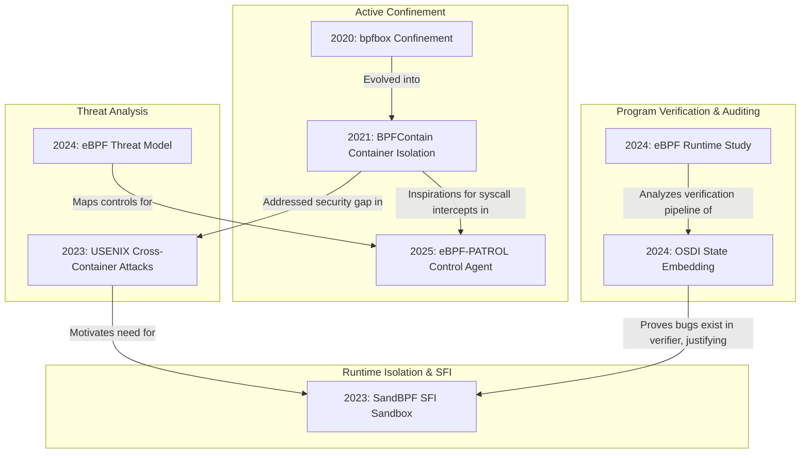

# Citation & Concept Relationship Graph

This section tracks how concepts and papers connect.

```mermaid
graph TD
    %% Papers
    bpfbox[2020: bpfbox Confinement]
    bpfcontain[2021: BPFContain Container Isolation]
    crosscontainer[2023: USENIX Cross-Container Attacks]
    sandbpf[2023: SandBPF SFI Sandbox]
    stateembed[2024: OSDI State Embedding]
    threatmodel[2024: eBPF Threat Model]
    runtimelinux[2024: eBPF Runtime Study]
    patrol[2025: eBPF-PATROL Control Agent]

    %% Citations & Influence
    bpfbox -->|Evolved into| bpfcontain
    bpfcontain -->|Addressed security gap in| crosscontainer
    crosscontainer -->|Motivates need for| sandbpf
    stateembed -->|Proves bugs exist in verifier, justifying| sandbpf
    threatmodel -->|Maps controls for| patrol
    runtimelinux -->|Analyzes verification pipeline of| stateembed
    bpfcontain -->|Inspirations for syscall intercepts in| patrol

    %% Research Focus Clusters
    subgraph Active Confinement
        bpfbox
        bpfcontain
        patrol
    end

    subgraph Runtime Isolation & SFI
        sandbpf
    end

    subgraph Program Verification & Auditing
        stateembed
        runtimelinux
    end

    subgraph Threat Analysis
        crosscontainer
        threatmodel
    end
```